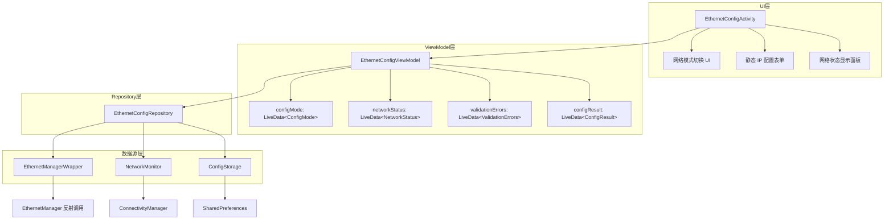
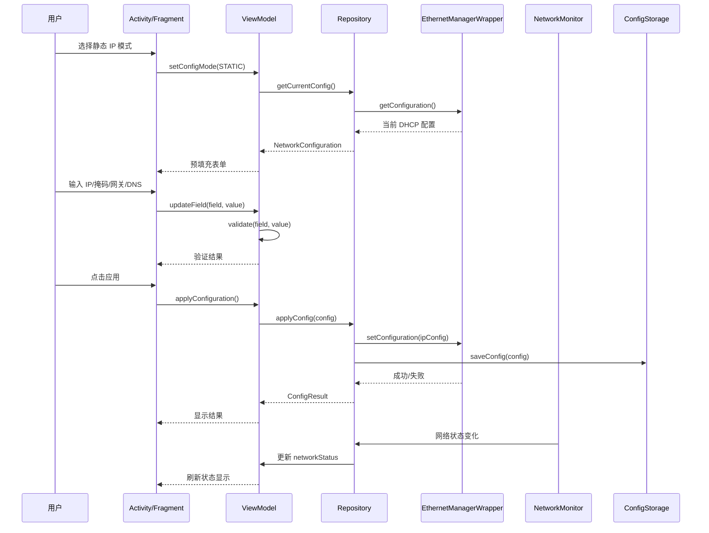
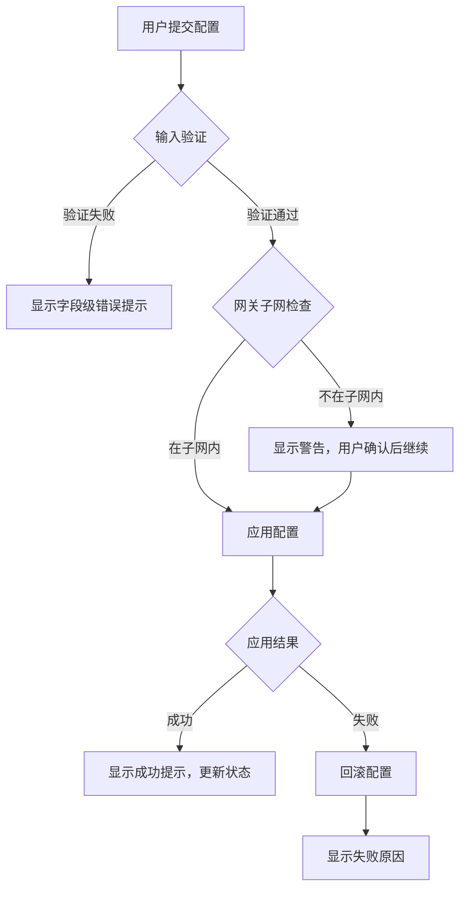

# 设计文档：Android 以太网配置工具

## 概述

本设计文档描述 Android 以太网（有线网卡）IP 和 DNS 配置工具的技术实现方案。该工具允许用户在 DHCP 和静态 IP 模式之间切换，手动配置 IP 地址、子网掩码、网关和 DNS 服务器，并实时查看网络状态。

### 技术选型

- **开发语言**：Kotlin
- **最低 SDK 版本**：Android API 24 (Android 7.0)
- **架构模式**：MVVM (Model-View-ViewModel)
- **UI 框架**：Android View 系统 + Material Design 组件
- **核心 API**：
  - `EthernetManager`（隐藏 API，通过反射调用）用于配置以太网接口
  - `ConnectivityManager` + `NetworkCallback` 用于监听网络状态变化
  - `SharedPreferences` 用于配置持久化存储

### 关键设计决策

1. **使用反射调用 EthernetManager**：`EthernetManager` 是 Android 隐藏 API，普通应用无法直接访问。方案采用反射机制调用 `setConfiguration` 方法，或通过引入系统 framework.jar 直接调用。这是 Android 以太网配置的标准做法。
2. **MVVM 架构**：将网络配置逻辑与 UI 分离，便于测试和维护。ViewModel 持有配置状态，Repository 封装底层 API 调用。
3. **SharedPreferences 持久化**：以太网配置参数通过 SharedPreferences 存储，配合系统级 `EthernetManager.setConfiguration` 实现重启后配置保留。
4. **ConnectivityManager 监听**：使用 `registerNetworkCallback` 监听以太网连接状态变化，通过 `NetworkCapabilities.TRANSPORT_ETHERNET` 过滤以太网事件。

## 架构

### 整体架构图



### 数据流



## 组件与接口

### 1. EthernetConfigActivity

主界面 Activity，负责 UI 展示和用户交互。

```kotlin
class EthernetConfigActivity : AppCompatActivity() {
    private val viewModel: EthernetConfigViewModel by viewModels()

    // 观察 ViewModel 状态并更新 UI
    // 处理用户输入事件
    // 管理 UI 组件的启用/禁用状态
}
```

### 2. EthernetConfigViewModel

核心 ViewModel，管理配置状态和业务逻辑。

```kotlin
class EthernetConfigViewModel(application: Application) : AndroidViewModel(application) {

    val configMode: LiveData<ConfigMode>           // 当前配置模式 (DHCP/STATIC)
    val networkStatus: LiveData<NetworkStatus>      // 网络连接状态
    val ipAddress: MutableLiveData<String>          // IP 地址输入
    val subnetMask: MutableLiveData<String>         // 子网掩码输入
    val gateway: MutableLiveData<String>            // 网关输入
    val primaryDns: MutableLiveData<String>         // 主 DNS 输入
    val secondaryDns: MutableLiveData<String>       // 备用 DNS 输入
    val validationErrors: LiveData<Map<Field, String>>  // 验证错误信息
    val isFormValid: LiveData<Boolean>              // 表单是否有效
    val configResult: LiveData<ConfigResult>        // 配置应用结果

    fun setConfigMode(mode: ConfigMode)             // 切换配置模式
    fun applyConfiguration()                        // 应用配置
    fun validateField(field: Field, value: String): ValidationResult  // 验证单个字段
}
```

### 3. EthernetConfigRepository

数据仓库，协调各数据源。

```kotlin
class EthernetConfigRepository(
    private val ethernetManager: EthernetManagerWrapper,
    private val networkMonitor: NetworkMonitor,
    private val configStorage: ConfigStorage
) {
    fun getCurrentConfiguration(): NetworkConfiguration
    fun applyConfiguration(config: NetworkConfiguration): Result<Unit>
    fun observeNetworkStatus(): LiveData<NetworkStatus>
    fun getStoredConfiguration(): NetworkConfiguration?
}
```

### 4. EthernetManagerWrapper

封装 EthernetManager 反射调用。

```kotlin
class EthernetManagerWrapper(private val context: Context) {

    fun getConfiguration(): NetworkConfiguration?
    fun setConfiguration(config: NetworkConfiguration): Result<Unit>
    fun setDhcpMode(): Result<Unit>
    fun isAvailable(): Boolean
}
```

**实现要点**：通过反射获取 `EthernetManager` 实例，构造 `IpConfiguration` 和 `StaticIpConfiguration` 对象，调用 `setConfiguration` 方法。需要 `android.permission.CONNECTIVITY_INTERNAL` 或系统签名权限。

### 5. NetworkMonitor

网络状态监听器。

```kotlin
class NetworkMonitor(private val context: Context) {

    private val connectivityManager: ConnectivityManager
    private val networkCallback: ConnectivityManager.NetworkCallback

    fun startMonitoring(): LiveData<NetworkStatus>
    fun stopMonitoring()
    fun getCurrentStatus(): NetworkStatus
}
```

**实现要点**：使用 `ConnectivityManager.registerNetworkCallback` 注册回调，通过 `NetworkRequest.Builder().addTransportType(NetworkCapabilities.TRANSPORT_ETHERNET)` 过滤以太网事件。回调中处理 `onAvailable`、`onLost`、`onCapabilitiesChanged` 和 `onLinkPropertiesChanged` 事件。

### 6. ConfigStorage

配置持久化存储。

```kotlin
class ConfigStorage(private val context: Context) {

    fun saveConfiguration(config: NetworkConfiguration)
    fun loadConfiguration(): NetworkConfiguration?
    fun clearConfiguration()
}
```

### 7. NetworkConfigValidator

网络参数验证工具类。

```kotlin
object NetworkConfigValidator {

    fun validateIpAddress(ip: String): ValidationResult
    fun validateSubnetMask(mask: String): ValidationResult
    fun validateGateway(gateway: String, ip: String, mask: String): ValidationResult
    fun validateDnsServer(dns: String): ValidationResult
    fun isGatewayInSubnet(gateway: String, ip: String, mask: String): Boolean
    fun isValidSubnetMask(mask: String): Boolean
}
```

**验证规则**：
- **IPv4 地址**：四组 0-255 的十进制数字，以点号分隔，如 `192.168.1.100`
- **子网掩码**：必须是连续高位 1 和低位 0 组成的 32 位二进制数的点分十进制表示，有效值包括 `255.255.255.0`、`255.255.0.0` 等
- **网关**：有效 IPv4 地址，且应在 IP 地址和子网掩码定义的子网范围内
- **DNS**：有效 IPv4 地址

## 数据模型

### ConfigMode（配置模式枚举）

```kotlin
enum class ConfigMode {
    DHCP,   // 自动获取
    STATIC  // 静态 IP
}
```

### NetworkConfiguration（网络配置）

```kotlin
data class NetworkConfiguration(
    val mode: ConfigMode,
    val ipAddress: String = "",
    val subnetMask: String = "",
    val gateway: String = "",
    val primaryDns: String = "",
    val secondaryDns: String = ""
)
```

### NetworkStatus（网络状态）

```kotlin
data class NetworkStatus(
    val isConnected: Boolean,
    val currentMode: ConfigMode?,
    val currentIpAddress: String?,
    val currentSubnetMask: String?,
    val currentGateway: String?,
    val currentDns: List<String>?
)
```

### ValidationResult（验证结果）

```kotlin
sealed class ValidationResult {
    object Valid : ValidationResult()
    data class Invalid(val errorMessage: String) : ValidationResult()
    data class Warning(val warningMessage: String) : ValidationResult()
}
```

### ConfigResult（配置应用结果）

```kotlin
sealed class ConfigResult {
    object Success : ConfigResult()
    data class Failure(val reason: String) : ConfigResult()
    object Loading : ConfigResult()
}
```

### Field（表单字段枚举）

```kotlin
enum class Field {
    IP_ADDRESS,
    SUBNET_MASK,
    GATEWAY,
    PRIMARY_DNS,
    SECONDARY_DNS
}
```


## 正确性属性

*属性是在系统所有有效执行中都应成立的特征或行为——本质上是对系统应做什么的形式化陈述。属性是人类可读规范与机器可验证正确性保证之间的桥梁。*

### 属性 1：IPv4 地址验证正确性

*对任意*由四组 0-255 范围内的十进制数字以点号分隔组成的字符串，`validateIpAddress` 函数应返回 Valid；*对任意*不符合此格式的字符串，应返回 Invalid。

**验证需求：2.4, 2.6, 3.3**

### 属性 2：子网掩码验证正确性

*对任意*前缀长度 n（0 ≤ n ≤ 32），由连续 n 个高位 1 和 (32-n) 个低位 0 组成的 32 位二进制数转换为点分十进制后，`validateSubnetMask` 函数应返回 Valid；*对任意*不符合此规则的点分十进制字符串，应返回 Invalid。

**验证需求：2.5**

### 属性 3：网关子网范围检查正确性

*对任意*有效的 IP 地址、子网掩码和网关地址，`isGatewayInSubnet` 函数返回 true 当且仅当 (gateway & mask) == (ip & mask)，即网关与 IP 地址在同一子网内。

**验证需求：2.7**

### 属性 4：切换到 DHCP 模式清除静态参数

*对任意* NetworkConfiguration（处于 STATIC 模式，包含任意有效的 IP、掩码、网关、DNS 参数），当执行 setConfigMode(DHCP) 后，ViewModel 中的所有手动配置字段（ipAddress、subnetMask、gateway、primaryDns、secondaryDns）应被清空。

**验证需求：1.4**

### 属性 5：切换到 STATIC 模式预填充 DHCP 参数

*对任意* NetworkStatus（处于已连接的 DHCP 模式，包含任意有效的当前网络参数），当执行 setConfigMode(STATIC) 后，ViewModel 中的配置字段应包含 NetworkStatus 中对应的当前参数值。

**验证需求：1.5**

### 属性 6：配置持久化往返

*对任意*有效的 NetworkConfiguration 对象，执行 `saveConfiguration` 后再执行 `loadConfiguration`，应返回与原始对象等价的 NetworkConfiguration。

**验证需求：4.2**

### 属性 7：配置失败回滚

*对任意*初始有效配置和任意新配置，当新配置应用失败时，系统当前生效的配置应与应用前的初始配置完全一致。

**验证需求：4.5**

### 属性 8：表单验证完整性

*对任意*静态 IP 模式下的表单状态，`isFormValid` 返回 true 当且仅当所有必填字段（IP 地址、子网掩码、网关、主 DNS）均非空且各字段通过对应的格式验证。

**验证需求：6.3, 6.4**

## 错误处理

### 错误分类

| 错误类型 | 触发条件 | 处理方式 |
|---------|---------|---------|
| 输入验证错误 | IPv4 格式无效、子网掩码无效 | 在对应字段下方显示错误提示，禁用提交按钮 |
| 网关子网警告 | 网关不在 IP/掩码定义的子网内 | 显示警告提示，但不阻止提交 |
| 配置应用失败 | EthernetManager 调用失败 | 显示包含失败原因的错误对话框，回滚到之前的有效配置 |
| 网络未连接 | 以太网接口未检测到连接 | 显示"未检测到以太网连接"提示，禁用所有配置操作 |
| 反射调用失败 | EthernetManager API 不可用 | 显示"当前设备不支持以太网配置"提示 |
| 权限不足 | 缺少系统级权限 | 显示"需要系统权限才能配置以太网"提示 |

### 错误处理流程



### 回滚策略

1. 在应用新配置前，保存当前有效配置的快照
2. 调用 `EthernetManager.setConfiguration` 应用新配置
3. 如果应用失败，使用快照恢复之前的配置
4. 如果恢复也失败，切换到 DHCP 模式作为最终兜底方案

## 测试策略

### 双重测试方法

本项目采用单元测试和属性基测试相结合的方式，确保全面的测试覆盖。

### 属性基测试

**测试框架**：[Kotest](https://kotest.io/) Property Testing 模块（`kotest-property`）

**配置要求**：
- 每个属性测试最少运行 100 次迭代
- 每个属性测试必须引用设计文档中的属性编号
- 标签格式：**Feature: android-ethernet-config, Property {number}: {property_text}**

**属性测试覆盖**：

| 属性编号 | 属性名称 | 测试目标 |
|---------|---------|---------|
| 属性 1 | IPv4 地址验证正确性 | `NetworkConfigValidator.validateIpAddress` |
| 属性 2 | 子网掩码验证正确性 | `NetworkConfigValidator.validateSubnetMask` |
| 属性 3 | 网关子网范围检查正确性 | `NetworkConfigValidator.isGatewayInSubnet` |
| 属性 4 | 切换到 DHCP 清除静态参数 | `EthernetConfigViewModel.setConfigMode` |
| 属性 5 | 切换到 STATIC 预填充参数 | `EthernetConfigViewModel.setConfigMode` |
| 属性 6 | 配置持久化往返 | `ConfigStorage.save/load` |
| 属性 7 | 配置失败回滚 | `EthernetConfigRepository.applyConfiguration` |
| 属性 8 | 表单验证完整性 | `EthernetConfigViewModel.isFormValid` |

**生成器设计**：
- **有效 IPv4 生成器**：生成四组 0-255 的随机数字，以点号连接
- **无效 IPv4 生成器**：生成包含超范围数字、非数字字符、错误分隔符、错误段数的字符串
- **有效子网掩码生成器**：从前缀长度 0-32 生成对应的点分十进制掩码
- **无效子网掩码生成器**：生成不满足连续高位 1 规则的点分十进制字符串
- **NetworkConfiguration 生成器**：组合有效的 IP、掩码、网关、DNS 生成随机配置对象
- **表单状态生成器**：生成包含有效/无效/空字段的随机组合

### 单元测试

**测试框架**：JUnit 5 + MockK

**单元测试覆盖**：

| 测试范围 | 测试内容 | 对应需求 |
|---------|---------|---------|
| UI 展示 | DHCP/STATIC 模式选项存在 | 1.1 |
| UI 展示 | 静态模式下显示所有输入字段 | 2.1, 2.2, 2.3, 3.1, 3.2 |
| UI 交互 | 选择 DHCP 后调用正确 API | 1.2 |
| UI 交互 | 选择 STATIC 后显示输入表单 | 1.3 |
| 表单规则 | 主 DNS 为必填项 | 3.4 |
| 表单规则 | 备用 DNS 为选填项 | 3.5 |
| 配置应用 | 成功时显示成功提示 | 4.3 |
| 配置应用 | 失败时显示错误原因 | 4.4 |
| 网络状态 | 显示连接/未连接状态 | 5.1 |
| 网络状态 | 已连接时显示网络参数 | 5.2 |
| 网络状态 | 显示当前网络模式 | 5.3 |
| 错误提示 | 无效 IP 显示特定错误消息 | 6.1 |
| 错误提示 | 无效掩码显示特定错误消息 | 6.2 |
| 网络检测 | 未连接时禁用配置操作 | 6.5 |

### 集成测试

| 测试范围 | 测试内容 | 对应需求 |
|---------|---------|---------|
| EthernetManager | DHCP 模式配置调用 | 1.2 |
| EthernetManager | 静态 IP 配置调用 | 4.1 |
| NetworkMonitor | 网络状态变化在 3 秒内更新 | 5.4 |
